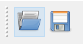
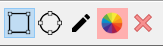
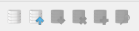
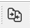
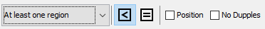
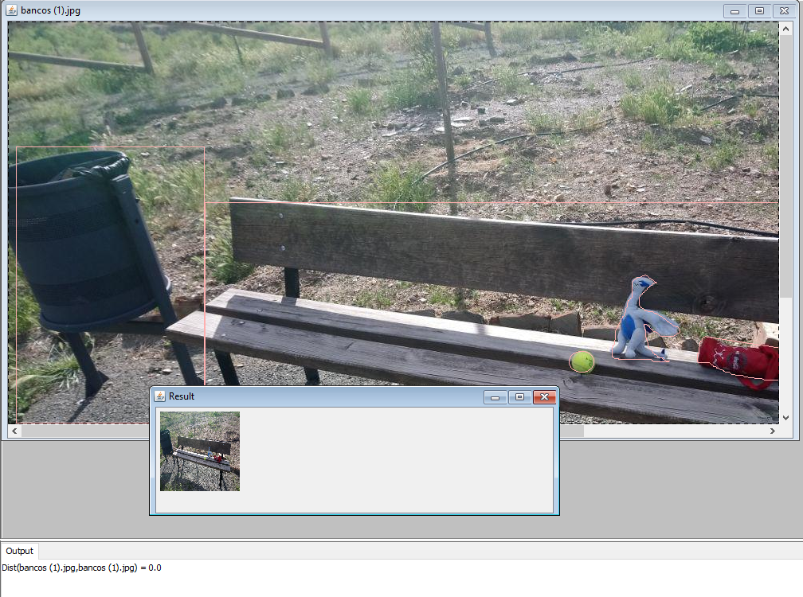

# CBIR-with-RoI
Repositorio con todo el material usado y creado en el desarrollo de sistemas de recuperación de imágenes basados en regiones. En dicho repositorio se recoge tanto el sistema realizado, creado para ello una biblioteca con todas las funcionalidades, como una aplicación de interfaz de usuario que permita a estos utilizar mi sistema. Además se incluye el material utilizado para la realización de pruebas.

## Introducción

El acceso a contenidos multimedia, y en particular a las bases de datos de imágenes, está adquiriendo cada vez mayor importancia. 
En este contexto, alcanzan gran relevancia los sistemas de recuperación de información, basados fundamentalmente en descriptores de bajo nivel 
(color, textura, etc.) obtenidos directamente a partir de la imagen. En estos sistemas, denominados **CBIR** por sus siglas en inglés, las imágenes 
se representan como vectores de descriptores, las consultas se definen utilizando una imagen o boceto, y la búsqueda de correspondencia entre 
ambas se realiza en base a una medida de similitud entre vectores.

En estos sistemas, los descriptores suelen ser de carácter global, es decir, calculados para la imagen entendida como un todo. Una mejora 
a este enfoque clásico consiste en la incorporación de **Regiones de Interés** (*Regions of Interest*) en el proceso de descripción y búsqueda. En las soluciones actuales, las aproximaciones locales se basan en enfoques orientados a cuadrículas (grids) de tamaño fijo, no tanto a regiones de interés; en este último caso, además de la selección de dichas regiones, surge el problema de (1) cómo calcular el descriptor asociado a una región de forma variable y (2) cómo calcular la semejanza entre dos imágenes con conjuntos de RoIs diferentes. En este contexto, el objetivo general de este proyecto ha sido el desarrollo de módulos integrados en la **JMR** (*Java Multimedia Retrieval ©*) para la descripción de imágenes basadas en **Regiones de Interés** (*RoI*), así como métricas que permitan realizar consultas basadas en dichos descriptores.

## Algunas pruebas

En el programa se da la posibilidad de elegir el tipo de comparadores para usar la búsqueda de imágenes similares a la actual, además del tipo de descriptores y atendiendo o no a la posición de los objetos a buscar. Aquí solo se recogen algunos ejemplos:

##### Buscando imágenes en las que al menos haya una región en común sin tener en cuenta su posición

En este ejemplo se encuentran fotografías que contengan la pelota amarilla. Puede estar ella sola, como en el primer resultado, o acompañada de más objetos, como se puede observar en las fotografías obtenidas (está utilizando el Comparador de imágenes en las que haya al menos una similitud entre ellas, en este caso, el de la pelota de tenis). La primera imagen, la más parecida solo tiene una pelota, mientras que el resto aparece la pelota junto a más elementos y en otras localizaciones.

Este otro ejemplo demuestra que no ha de estar solo un objeto, que se pueden buscar varios objetos utilizando el mismo comparador del ejemplo anterior. En este caso los resultados muestran imágenes donde esté uno o los dos objetos a buscar (escuche y pelota).

##### Buscando imágenes en las que al menos haya una región en común teniendo en cuenta su posición

Utilizando de nuevo el ejemplo de la pelota, pero esta vez, teniendo en cuenta la posición. Se devuelven imágenes donde la pelota esté situada o cuyo centro esté situado alrededor de la que se usó como criterio de búsqueda. En el resultado se contemplan imágenes que tienen una pelota alrededor de la posición de donde está la de la imagen usada como búsqueda.

##### Buscando imágenes en las que estén todas las regiones en común sin tener en cuenta su posición

Esta última comparación buscará imágenes que tengan tanto la pelota como el estuche de color rojo (sin tener en cuenta su posición). Por ello devuelve imágenes que contienen los dos objetos sí o sí, ya sean ellos dos solos o acompañados de otros objetos.

Se pueden utilizar este método de nuevo para buscar dos objetos pero teniendo en cuenta su posición. Adicionalmente, se pueden utilizar otro tipo de comparadores y métricas. Todas ellas están comentadas en la documentación del programa.

## Funcionamiento del programa

A continuación se presenta un pequeño manual describiendo los distintos elementos del programa para su utilización.

#### Menús superiores

Hay tres tipos de menú en la parte superior:

* **Menú *File***: Se encarga de abrir o guardar una imagen con o sin figuras. Se explicará en la sección *Abrir/Guardar* cómo se usan estos menús.
* **Menú *View***: Se encarga de la ocultación y visualización de paneles de la aplicación.
* **Menú *Tools***: Ofrece un par de herramientas adicionales, como son:
  * **Añadir un directo**: Añade a la base de datos un directorio de imágenes con o sin región. Leerá el fichero de la imagen y a partir de ella, si tiene alguno asociado, el fichero *csv* con las figuras. 
  * **Mostrar base de datos:** Si hay una base de datos con imágenes, al pulsar mostrará un listado con las imágenes que hay en dicha base de datos. Hay que tener cuidado, pues con bases de datos muy grandes, el programa colapsa.

#### Abrir/Guardar

Son dos botones principalmente:

* **Botón Abrir:** Al pulsarlo se abrirá un menú mostrando directorios de nuestro ordenador. Desde él buscaremos archivos que sean imágenes y al seleccionarlo se abrirá una nueva ventana en nuestro programa con la imagen. Si existía un fichero *csv* asociado a la imagen, se mostrarán también las figuras que contenía. Se pueden abrir varias imágenes a la vez, manteniendo el botón *Control* pulsado y seleccionando varios ficheros con el ratón o teclado. 
* **Botón Guardar:** En caso de que hayamos dibujado formas y queramos guardarlas, al pulsar sobre el botón guardar se abrirá un menú que nos permitirá guardar en un archivo *csv* las figuras dibujadas.

#### Dibujo de formas

Herramientas para el dibujado de figuras sobre la imagen para delimitar o indicar la región.

* **Herramienta cuadrado:** Permite dibujar cuadrados sobre la imagen. Se dejará pulsado el ratón sobre el lienzo y se moverá a la vez para indicar el tamaño que tendrá. Al soltarlo, se quedará dibujada dicha figura.
* **Herramienta círculo:** Si la seleccionamos, pasaremos a poder dibujar círculos. El proceso de dibujado es similar al del cuadrado.
* **Herramienta trazo libre:** Herramienta para el dibujado de figuras aleatorias. Al soltar el ratón, esta se cerrará.
* **Selección de color:** Permite cambiar el color del trazo de las figuras. Por defecto está como color rosa. Al pulsar sobre él, se abrirá una venta que muestra muchos tipos de colores diferentes. Al seleccionar, se cambiarán todas las figuras a ese nuevo color.
* **Eliminar figuras:** Este botón permite eliminar todas las figuras dibujadas sobre el lienzo actual.

#### Base de datos

Se muestra una botonera sobre las distintas operaciones con la base de datos. De izquierda a derecha:

* **Crear una nueva base de datos:** Se crea una nueva base de datos vacía. Si se pulsa con el botón derecho del razón sobre el icono, mostrará un menú desplegable para seleccionar el tipo de descriptor que se usará para crear la base de datos.
* **Abrir una base de datos:** En caso de que tengamos nuestra base de datos guardada en un fichero, se ofrece la posibilidad de poder usar el archivo para crear la base de datos, es decir, abrirla. Se abrirá un menú para buscar la base de datos. Se buscan solo archivos *.dat*, que es la extensión que tienen las bases de datos.
* **Guardar base de datos:** en caso de que haya una base de datos en uso en el programa, existe la posibilidad de que se pueda guardar. Al pulsar sobre el botón, se abrirá una ventana para guardar dicha base de datos. Las bases de datos se guardan, como comentaba, con la extensión *.dat*.
* **Eliminar base de datos:** Con este botón se elimina la base de datos, completamente. No se trata de un borrado de contenido, sino que no habrá ninguna base de datos en el programa.
* **Añadir elemento actual a la base de datos:** Se añadirá el contenido de la ventana seleccionada a la base de datos al pulsar sobre el botón.
* **Buscar elemento actual:** Este botón permite la búsqueda de la ventana actual, de la imagen con o sin figuras, en la base de datos. El resultado dependerá del tipo de descriptor usado y los comparadores y métricas. Se mostrará una nueva ventana con los resultados, donde con doble clic se podrán agrandar para verse mejor.

#### Comparador de escritorio

Este único botón permite hacer una comparativa de todas las imágenes abiertas en pantalla con la que está seleccionada. Para cambiar el tipo de descriptor que se quiera usar, basta con pulsar con el botón izquierdo sobre el icono. A partir de ese descriptor se calculará la distancia con el resto de ventanas y se abrirá una nueva ventana con el resultado ordenado de menor a mayor. En la parte inferior, se mostrará por testo la comparativa de una imagen con la otra utilizando el descriptor y métricas seleccionados.

#### Herramientas de comparadores y métricas

Son varios los elementos a destacar en este apartado. Dichos elementos son:

* **Selector del tipo de comparador:** Es de tres tipos, desde al menos una región en común, el mayor número y la media.
* **Botón Incursión Simple:** Si está seleccionado, el comparador tendrá en cuenta que será incursión simple la métrica usada para las búsquedas. Por defecto está seleccionada.
* **Botón Igualdad:** Al seleccionarlo, cambiará el tipo de comparador usado para usar la igualdad. 
* **Botón Posición:** Si se selecciona, se tendrá además en cuenta la posición de las regiones a la hora de realizas las búsquedas en la base de datos.
* **Botón Sin Repeticiones:** Si se selecciona, evitará que varias regiones apunten a una misma región, haciendo un cálculo más realista.

#### Muestra de resultados

En el escritorio del programa se mostrarán tanto los lienzos que se abran (uno o varios). Abajo aparecerá una ventana con un listado de imágenes con las que la actual imagen tiene similitudes, dependiendo del comparador y descriptor usados.

#### Barra inferior

La barra inferior del programa muestra tres tipos de información:

* Información sobre el punto actual donde está el cursor. Muestra:
  * Coordenadas del píxel donde está el cursor situado.
  * Información de los colores de dicho pixel (Rojo, azul, verde y, si existe, valor alfa).
* Información de la base de datos que hay actualmente en uso. Indicará el número de entradas y el tipo de descriptor en uso. Si no hay ninguna utilizándose, mostrará un mensaje que indica que no hay nada.

## Material disponible

En este repositorio está disponible el siguiente material:

 - **JMR.RSG** es una extensión de la biblioteca **JMR** enfocada a la recuperación de imágenes por contenido, y en función a sus regiones de interés. Dicha biblioteca **JMR** puede ser consultada en [https://github.com/jesuschamorro/JMR](https://github.com/jesuschamorro/JMR).
 - **JMR.Application** es la interfaz de usuario que permite a cualquier persona utilizar el sistema desarrollado. Ofrece una interfaz gráfica en la que se puede abrir imágenes, seleccionar las regiones de ésta con herramientas de dibujo, manipular la base de datos, etc.
 - Material adicional, como imágenes con su archivo .csv correspondiente que guarda las regiones de dichas figuras.

Se acompaña el código de la biblioteca y aplicación con su documentación *javadocs*, accesible desde *dist/javadocs*. Para la utilización del programa, recomiendo el uso de un IDE. Yo recomiendo [Netbeans](https://netbeans.org/).

